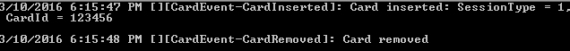

# EventBuilder [](https://ci.appveyor.com/project/yuanfei/eventbuilder)
A library for custom event definition, generation, publishing and consuming

##Event Definition
```csharp
[EventSourceType("CardEvent")]
public interface ICardEventSource
{
    [EventType("CardInserted", MessageTemplate = "Card inserted: SessionType = {0}, CardId = {1}", Level = EventLevel.Info, PayLoadType = typeof(CardEventPayLoad))]
    void CardInserted([PayLoadProperty("SessionType")]int sessionType, [PayLoadProperty("CardId")]string cardId);

    [EventType("CardRemoved", MessageTemplate = "Card removed", Level = EventLevel.Info)]
    void CardRemoved();
}

public class CardEventPayLoad
{
    public int SessionType { get; set; }
    public string CardId { get; set; }
}
```

##Using event
```csharp
//Configure consumer
EventBroker.Instance.AddEventConsumers(new FileConsumer(1),
  new ConsoleConsumer() {EventFilter = new BaseFilter(e => e.Level == EventLevel.Info)});

//Create event source
var evtSource = EventBroker.Instance.EventSourceContainer.GetEventSource<ICardEventSource>();

//Raise event
evtSource.CardInserted(1, "123456");
evtSource.CardRemoved();
```

##Output
